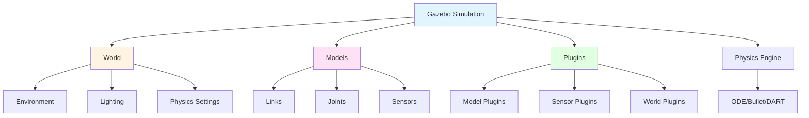
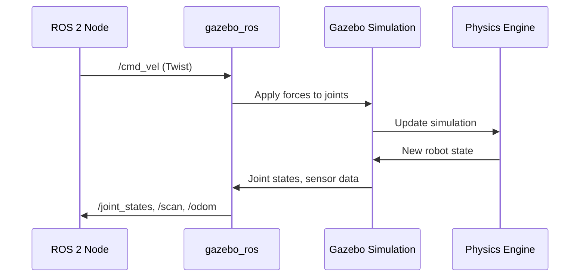

# Gazebo Architecture

Learn the fundamental components of Gazebo simulation: worlds, models, plugins, and how they interact to create realistic robot simulations.

## Learning Objectives

By the end of this lesson, you will:
- Understand Gazebo's architecture and core components
- Know the difference between worlds, models, and plugins
- Understand how Gazebo integrates with ROS 2
- Be able to navigate the Gazebo GUI and understand simulation concepts

## Prerequisites

- ROS 2 Humble installed ([Installation Guide](../../module-1-ros2/ch1-fundamentals/installation.md))
- Basic understanding of URDF ([URDF Syntax](../../module-1-ros2/ch3-urdf/urdf-syntax.md))
- Familiarity with ROS 2 topics and nodes

## What is Gazebo?

**Gazebo** is an open-source 3D robotics simulator that provides:
- **Realistic physics**: Gravity, friction, inertia, collisions
- **Sensor simulation**: LiDAR, cameras, IMUs, GPS
- **ROS 2 integration**: Seamless communication with ROS 2 nodes
- **Visualization**: 3D rendering of robots and environments
- **Plugin system**: Extensible architecture for custom behaviors

Gazebo is the industry-standard simulator for ROS robotics development, used by researchers, students, and companies worldwide.

## Gazebo Architecture Overview



## Core Components

### 1. World

The **world** is the top-level container for your simulation.

**What it contains:**
- Environment definition (ground plane, sky, lighting)
- Physics engine configuration (gravity, solver settings)
- Global simulation parameters (real-time factor, step size)
- References to all models in the scene

**Example world structure (SDF):**
```xml
<?xml version="1.0"?>
<sdf version="1.8">
  <world name="my_world">
    <!-- Physics engine settings -->
    <physics type="ode">
      <max_step_size>0.001</max_step_size>
      <real_time_factor>1.0</real_time_factor>
    </physics>

    <!-- Lighting -->
    <light name="sun" type="directional">
      <pose>0 0 10 0 0 0</pose>
      <diffuse>1 1 1 1</diffuse>
    </light>

    <!-- Ground plane -->
    <include>
      <uri>model://ground_plane</uri>
    </include>
  </world>
</sdf>
```

**Key world parameters:**
- `gravity`: Gravitational acceleration (default: 0 0 -9.81)
- `max_step_size`: Simulation time step (default: 0.001s = 1ms)
- `real_time_factor`: How fast to run simulation (1.0 = real-time)

### 2. Models

**Models** are the objects in your simulation (robots, obstacles, furniture).

**What they contain:**
- **Links**: Rigid bodies with mass, inertia, collision geometry
- **Joints**: Connections between links (revolute, prismatic, fixed)
- **Sensors**: Cameras, LiDAR, IMU attached to links
- **Plugins**: Custom behaviors and control logic

**Model hierarchy:**
```
Model (e.g., "my_robot")
├── Link 1 (e.g., "base_link")
│   ├── Visual (appearance)
│   ├── Collision (physics)
│   └── Inertial (mass, inertia)
├── Link 2 (e.g., "wheel_left")
├── Joint 1 (connects Link 1 ↔ Link 2)
└── Sensor 1 (e.g., "camera")
```

**Example model snippet:**
```xml
<model name="simple_box">
  <link name="box_link">
    <pose>0 0 0.5 0 0 0</pose>

    <!-- Visual appearance -->
    <visual name="visual">
      <geometry>
        <box><size>1 1 1</size></box>
      </geometry>
    </visual>

    <!-- Collision shape -->
    <collision name="collision">
      <geometry>
        <box><size>1 1 1</size></box>
      </geometry>
    </collision>

    <!-- Physical properties -->
    <inertial>
      <mass>10.0</mass>
      <inertia>
        <ixx>1.67</ixx>
        <iyy>1.67</iyy>
        <izz>1.67</izz>
      </inertia>
    </inertial>
  </link>
</model>
```

### 3. Plugins

**Plugins** extend Gazebo's functionality with custom code.

**Three types of plugins:**

| Plugin Type | Purpose | Example Use Cases |
|-------------|---------|-------------------|
| **World Plugins** | Global behaviors, environment control | Wind simulation, dynamic lighting |
| **Model Plugins** | Robot control, actuators | Wheel controllers, arm manipulation |
| **Sensor Plugins** | Sensor data processing, publishing | Camera → ROS topic, LiDAR filtering |

**Example: Model plugin for differential drive**
```xml
<plugin name="differential_drive" filename="libgazebo_ros_diff_drive.so">
  <ros>
    <namespace>/my_robot</namespace>
  </ros>

  <left_joint>wheel_left_joint</left_joint>
  <right_joint>wheel_right_joint</right_joint>

  <wheel_separation>0.5</wheel_separation>
  <wheel_diameter>0.2</wheel_diameter>

  <publish_odom>true</publish_odom>
  <publish_odom_tf>true</publish_odom_tf>

  <odometry_topic>odom</odometry_topic>
  <odometry_frame>odom</odometry_frame>
  <robot_base_frame>base_link</robot_base_frame>
</plugin>
```

**Common Gazebo ROS 2 plugins:**
- `libgazebo_ros_diff_drive.so`: Differential drive controller
- `libgazebo_ros_joint_state_publisher.so`: Publishes joint states
- `libgazebo_ros_camera.so`: Camera sensor
- `libgazebo_ros_ray_sensor.so`: LiDAR sensor
- `libgazebo_ros_imu_sensor.so`: IMU sensor

### 4. Physics Engine

Gazebo supports multiple physics engines:

| Engine | Pros | Cons | Best For |
|--------|------|------|----------|
| **ODE** (default) | Fast, stable, well-tested | Less accurate contacts | Mobile robots, general use |
| **Bullet** | Good contact dynamics | Slower than ODE | Manipulation, grasping |
| **DART** | Advanced constraints, stable | Newer, less tested | Complex mechanisms |

**Physics configuration:**
```xml
<physics type="ode">
  <max_step_size>0.001</max_step_size>
  <real_time_factor>1.0</real_time_factor>
  <real_time_update_rate>1000</real_time_update_rate>

  <ode>
    <solver>
      <type>quick</type>
      <iters>50</iters>
    </solver>
    <constraints>
      <cfm>0.0</cfm>
      <erp>0.2</erp>
      <contact_max_correcting_vel>100.0</contact_max_correcting_vel>
      <contact_surface_layer>0.001</contact_surface_layer>
    </constraints>
  </ode>
</physics>
```

**Key physics parameters:**
- `max_step_size`: Smaller = more accurate but slower (0.001s is good default)
- `real_time_factor`: &gt;1.0 = faster than real-time, &lt;1.0 = slower
- `iters`: Solver iterations (higher = more accurate but slower)

## SDF vs URDF

Gazebo uses **SDF (Simulation Description Format)**, not URDF directly.

| Feature | URDF | SDF |
|---------|------|-----|
| **Purpose** | Robot description for ROS | Simulation worlds and models |
| **Flexibility** | Limited to robot kinematics | Full simulation scenes |
| **Physics** | Basic (mass, inertia) | Advanced (friction, damping, contacts) |
| **Sensors** | Not supported | Full sensor definitions |
| **Gazebo Support** | Converted to SDF internally | Native format |

**Good news**: You can use URDF files in Gazebo! They're automatically converted to SDF.

**When to use each:**
- **URDF**: Robot description, ROS 2 packages, simple models
- **SDF**: Complex worlds, advanced physics, multiple robots

## Gazebo GUI Components

When you launch Gazebo, you see several panels:

### Scene View (Center)
- 3D visualization of world
- Camera controls: Rotate (drag), Pan (Shift+drag), Zoom (scroll)
- Selection tool: Click objects to inspect

### World Panel (Left)
- Tree view of all models and lights
- Insert models from library
- Adjust model poses

### Model Editor (Optional)
- Visual model builder
- Link/joint creation
- Save custom models

### Time Panel (Bottom)
- Play/Pause simulation
- Real-time factor (actual speed vs wall-clock time)
- Simulation time vs real time

## How Gazebo Integrates with ROS 2



**Key integration points:**
1. **Command topics** (ROS → Gazebo): `/cmd_vel`, `/joint_commands`
2. **Sensor topics** (Gazebo → ROS): `/scan`, `/camera/image_raw`, `/imu`
3. **State topics** (Gazebo → ROS): `/joint_states`, `/odom`, `/tf`
4. **Services** (ROS ↔ Gazebo): `/spawn_entity`, `/delete_entity`

**The `gazebo_ros` package** provides:
- `spawn_entity.py`: Load URDF/SDF models into running simulation
- `gazebo_ros_state`: Publish model states
- ROS 2 plugins for sensors and actuators

## Launching Gazebo with ROS 2

### Method 1: Launch Gazebo alone
```bash
# Launch Gazebo with empty world
gazebo --verbose

# Launch with specific world file
gazebo worlds/my_world.sdf
```

### Method 2: Launch Gazebo from ROS 2 launch file
```python
from launch import LaunchDescription
from launch.actions import IncludeLaunchDescription
from launch.launch_description_sources import PythonLaunchDescriptionSource
from launch_ros.substitutions import FindPackageShare

def generate_launch_description():
    gazebo = IncludeLaunchDescription(
        PythonLaunchDescriptionSource([
            FindPackageShare('gazebo_ros'),
            '/launch/gazebo.launch.py'
        ]),
        launch_arguments={'world': 'my_world.sdf'}.items()
    )

    return LaunchDescription([gazebo])
```

### Method 3: Spawn robot in running Gazebo
```bash
# Terminal 1: Start Gazebo
ros2 launch gazebo_ros gazebo.launch.py

# Terminal 2: Spawn robot from URDF
ros2 run gazebo_ros spawn_entity.py -entity my_robot -file my_robot.urdf
```

## Understanding Simulation Time

**Simulation time** ≠ **Real time** (wall-clock time)

- **Real-time factor (RTF)**: How fast simulation runs compared to reality
  - RTF = 1.0 → 1 second of simulation = 1 second of real time
  - RTF = 0.5 → Simulation runs at half speed (slow motion)
  - RTF = 2.0 → Simulation runs twice as fast (if your computer can handle it)

- **Step size**: How much simulation time advances per iteration
  - Default: 0.001s (1ms)
  - Smaller step = more accurate but slower

**Why simulation might run slower than real-time:**
- Complex physics calculations
- Many contacts/collisions
- High-resolution sensors (cameras, LiDAR)
- CPU limitations

**Tip**: Monitor RTF in Gazebo GUI bottom panel. If RTF &lt; 1.0, simulation is struggling.

## Common Gazebo Workflows

### 1. Testing a Robot URDF
```bash
# Convert URDF to SDF and inspect
gz sdf -p my_robot.urdf

# Launch in Gazebo
ros2 launch gazebo_ros gazebo.launch.py
ros2 run gazebo_ros spawn_entity.py -entity test_robot -file my_robot.urdf
```

### 2. Building a Custom World
1. Create `.sdf` file with world definition
2. Add ground plane, lighting, obstacles
3. Configure physics parameters
4. Launch: `gazebo my_world.sdf`

### 3. Adding Sensors to Existing Model
1. Edit model SDF
2. Add sensor definition under `<link>`
3. Add sensor plugin (e.g., `libgazebo_ros_camera.so`)
4. Reload model in Gazebo

## Best Practices

### Performance Optimization
1. **Use appropriate step size**: 0.001s is good default
2. **Limit real-time factor**: Don't try to run faster than your CPU allows
3. **Simplify collision geometry**: Use primitive shapes (boxes, cylinders) instead of meshes
4. **Reduce sensor update rates**: Cameras at 10-30 Hz, LiDAR at 10 Hz is usually sufficient
5. **Disable shadows** for faster rendering: Edit → View → Shadows (uncheck)

### Debugging Simulation Issues
1. **Check physics stability**: If robot jitters or explodes, reduce step size
2. **Inspect contacts**: View → Contacts to see collision points
3. **Verify inertia**: Use `check_urdf` or Gazebo model editor
4. **Monitor RTF**: If &lt; 0.5, simplify physics or models

### Organizing Gazebo Files
```
my_robot_gazebo/
├── worlds/
│   ├── empty.sdf
│   └── warehouse.sdf
├── models/
│   └── my_robot/
│       ├── model.sdf
│       └── meshes/
├── launch/
│   └── gazebo.launch.py
└── config/
    └── gazebo_params.yaml
```

## Check Your Understanding

1. **What are the three main types of Gazebo plugins?**
   <details>
   <summary>Answer</summary>
   World plugins (global behaviors), Model plugins (robot control), Sensor plugins (sensor data processing and publishing).
   </details>

2. **What's the difference between URDF and SDF?**
   <details>
   <summary>Answer</summary>
   URDF is for robot kinematics (ROS-focused), while SDF is for full simulation scenes with advanced physics, sensors, and multiple models. Gazebo converts URDF to SDF internally.
   </details>

3. **If your simulation real-time factor (RTF) is 0.5, what does that mean?**
   <details>
   <summary>Answer</summary>
   The simulation is running at half speed - it takes 2 seconds of real time to simulate 1 second. This indicates the physics/rendering is too complex for your CPU.
   </details>

4. **Why use collision geometry simpler than visual meshes?**
   <details>
   <summary>Answer</summary>
   Physics calculations on complex meshes are very slow. Using primitive shapes (boxes, cylinders, spheres) for collision while keeping detailed meshes for visuals dramatically improves performance.
   </details>

## Key Takeaways

- **Gazebo architecture**: World contains models with links, joints, sensors, and plugins
- **SDF format**: Native Gazebo format, more powerful than URDF for simulation
- **Physics engines**: ODE (default, fast), Bullet (contacts), DART (advanced)
- **Plugins enable ROS 2 integration**: Sensors publish to topics, actuators subscribe to commands
- **Step size and RTF**: Balance accuracy (small step) vs speed (high RTF)
- **URDF works in Gazebo**: Automatically converted to SDF

## What's Next?

Now that you understand Gazebo's architecture:

- **Next Lesson**: [Spawning Robots in Gazebo](./spawning-robots.md) - Load URDF/SDF models
- **Related**: [Physics Parameters](./physics-parameters.md) - Tune gravity, friction, contacts
- **Advanced**: [Sensor Plugins](./sensor-plugins.md) - Add LiDAR, cameras, IMU

## Further Reading

- [Gazebo Official Documentation](https://gazebosim.org/docs)
- [SDF Format Specification](http://sdformat.org/)
- [Gazebo ROS 2 Integration](https://github.com/ros-simulation/gazebo_ros_pkgs)
- [Understanding Physics Engines](https://gazebosim.org/api/gazebo/6/physics.html)
