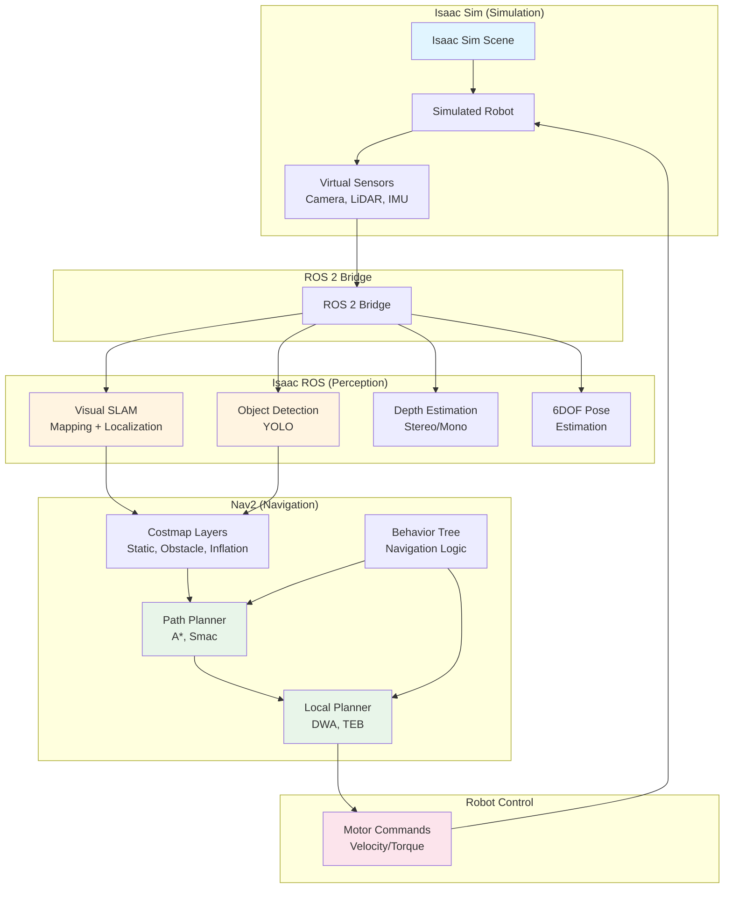
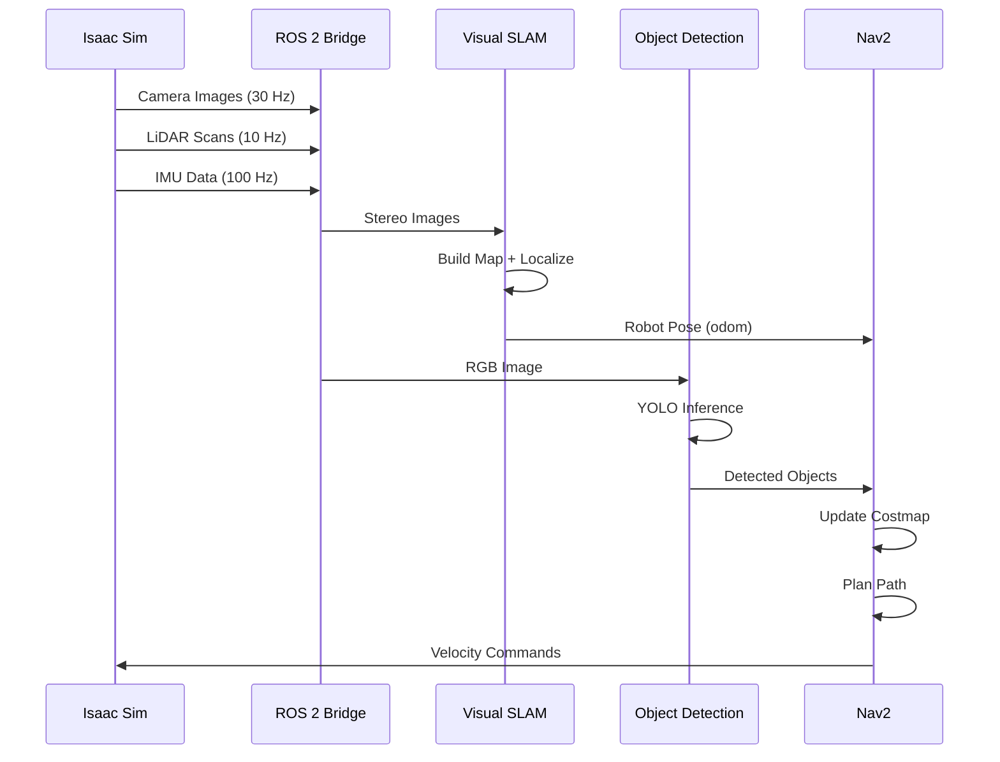

# Isaac Sim → Isaac ROS → Nav2 Pipeline

## System Architecture Diagram



## Data Flow

### Perception Pipeline



## Component Interaction

### Isaac Sim → Isaac ROS

| Isaac Sim Output | ROS 2 Topic | Isaac ROS Consumer | Purpose |
|------------------|-------------|-------------------|---------|
| RGB Camera | `/camera/image_raw` | Object Detection, VSLAM | Vision input |
| Stereo Camera | `/stereo/left`, `/stereo/right` | Stereo Depth | 3D perception |
| LiDAR Scan | `/scan` | Obstacle Layer | Collision avoidance |
| IMU | `/imu/data` | VSLAM, Odometry | Motion estimation |
| Depth Image | `/camera/depth` | Depth Estimation | 3D mapping |

### Isaac ROS → Nav2

| Isaac ROS Output | Nav2 Consumer | Purpose |
|------------------|---------------|---------|
| `/visual_slam/tracking/odometry` | Localization | Robot pose |
| `/detections` | Semantic Layer | Object-aware planning |
| `/point_cloud` | Costmap | 3D obstacle detection |
| `/depth_image` | Costmap | Obstacle detection |

### Nav2 → Robot Control

| Nav2 Output | Robot Actuator | Purpose |
|-------------|----------------|---------|
| `/cmd_vel` (Twist) | Wheel Motors | Differential drive |
| `/joint_commands` | Joint Controllers | Humanoid locomotion |

## Performance Characteristics

```mermaid
gantt
    title Processing Latency (ms)
    dateFormat X
    axisFormat %L

    section Perception
    Camera Capture           :0, 33
    VSLAM Update            :33, 50
    Object Detection        :33, 20

    section Planning
    Costmap Update          :50, 200
    Global Planning         :200, 50
    Local Planning          :250, 50

    section Control
    Command Generation      :300, 10
    Motor Actuation         :310, 20
```



**Total Latency**: ~330ms (camera → motor commands)
**Target**: &lt;500ms for safe navigation

## Scalability

### Parallel Processing

```
Isaac Sim: 1 Scene
    ↓
Isaac ROS: 4 Perception Nodes (parallel on GPU)
    ↓
Nav2: 3 Planners (sequential)
    ↓
Robot: 1 Controller
```

**Throughput**: 30 FPS end-to-end

---

This diagram illustrates the complete data flow from simulation through perception to autonomous navigation in the Isaac ecosystem.
