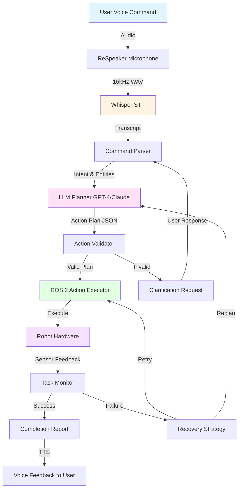
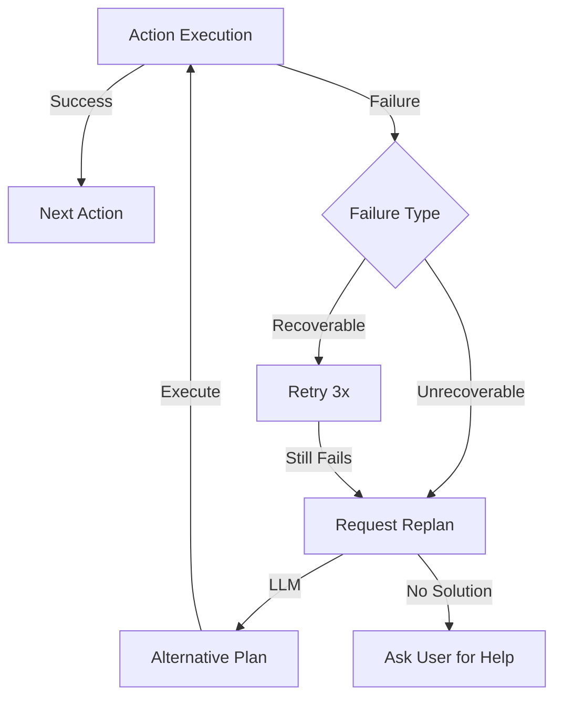

# VLA Pipeline Architecture Diagram

## Complete System Flow



## Component Details

| Component | Technology | Latency | Purpose |
|-----------|-----------|---------|---------|
| **ReSpeaker** | USB Microphone Array | ~0ms | Far-field audio capture with beamforming |
| **Whisper STT** | OpenAI API / Local Model | 500-2000ms | Speech-to-text transcription |
| **Command Parser** | spaCy NLU | 50-100ms | Extract intent and entities |
| **LLM Planner** | GPT-4o-mini / Claude | 1000-3000ms | Generate action sequences |
| **Action Validator** | Python Logic | 10ms | Check feasibility and safety |
| **ROS 2 Executor** | Action Servers | Varies | Execute robot actions |
| **Task Monitor** | ROS 2 Feedback | Real-time | Monitor execution and detect failures |

## Data Flow Example

### Input
```
User says: "Go to the kitchen and pick up the red cup"
```

### Pipeline Processing

1. **Audio Capture** (ReSpeaker)
   ```
   16kHz mono audio → 3-second buffer → WAV file
   ```

2. **Speech-to-Text** (Whisper)
   ```
   WAV → Whisper API → "Go to the kitchen and pick up the red cup"
   ```

3. **Command Parsing** (spaCy)
   ```json
   {
     "intent": "compound_task",
     "entities": {
       "locations": ["kitchen"],
       "objects": ["cup"],
       "colors": ["red"],
       "actions": ["go", "pick"]
     }
   }
   ```

4. **LLM Planning** (GPT-4)
   ```json
   {
     "plan": [
       {"action": "navigate", "location": "kitchen"},
       {"action": "scan", "target": "cup"},
       {"action": "pick", "object": "cup", "color": "red"}
     ],
     "reasoning": "Navigate to kitchen first, then scan to locate the red cup, finally execute pick action"
   }
   ```

5. **Validation** (Safety Checks)
   ```
   ✓ Location "kitchen" exists
   ✓ Object "cup" in known objects list
   ✓ Action sequence is feasible
   ✓ No safety violations
   ```

6. **Execution** (ROS 2 Actions)
   ```
   Action 1: navigate("kitchen") → Success (5.2s)
   Action 2: scan("cup") → Found at (0.5, 0.3, 0.75) (1.8s)
   Action 3: pick("cup", "red") → Grasped (3.1s)
   ```

7. **Completion** (Feedback)
   ```
   "I've successfully picked up the red cup from the kitchen."
   ```

## Error Handling Flow



## Performance Metrics

**End-to-End Latency Breakdown**:
- Audio Capture: 3000ms (buffer duration)
- Whisper Transcription: 800ms
- Command Parsing: 50ms
- LLM Planning: 1500ms
- Validation: 10ms
- **Total Thinking Time**: ~5.4 seconds
- Action Execution: Varies (3-30 seconds)

**Optimization Strategies**:
- Use local Whisper (500ms instead of 800ms)
- Cache frequent command patterns
- Parallelize visual grounding with planning
- Use faster LLM (GPT-4o-mini vs GPT-4)

---

This diagram can be embedded in lessons using:

```markdown
See [VLA Pipeline Diagram](../vla-pipeline-diagram.md) for the complete system architecture.
```
