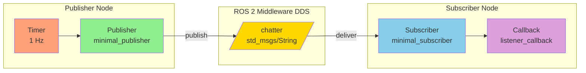
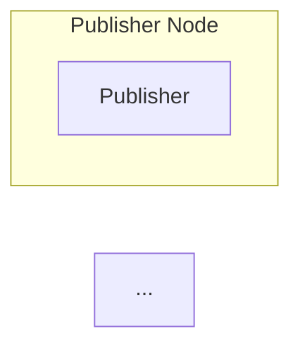

# ROS 2 Node Graph: Publisher/Subscriber Pattern

This diagram shows the communication flow between a publisher node and subscriber node in ROS 2.

## Explanation

- **Publisher Node**: Contains a timer that triggers publishing at 1 Hz
- **Topic** (`/chatter`): Message bus where String messages flow
- **Subscriber Node**: Listens to the topic and processes messages in a callback
- **DDS Middleware**: Handles message delivery between nodes (transparent to users)

## Usage in Docusaurus

To embed this diagram in a Docusaurus page, use:

\`\`\`markdown

\`\`\`

Or reference this file:

\`\`\`markdown
import MermaidDiagram from '@site/static/img/module-1-ros2/diagrams/node-graph-pubsub.md';
\`\`\`
