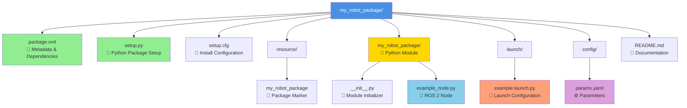
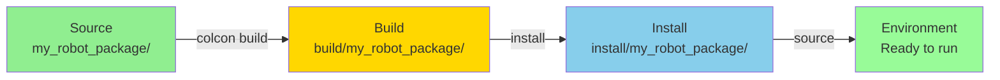

# ROS 2 Package Structure

This diagram shows the file organization of a complete ROS 2 Python package.

## File Descriptions

### Core Package Files

| File | Purpose |
|------|---------|
| `package.xml` | Declares package name, version, dependencies, and metadata (ROS 2 format) |
| `setup.py` | Python package configuration - defines entry points for nodes |
| `setup.cfg` | Installation directories configuration |

### Resource Directory

| File | Purpose |
|------|---------|
| `resource/my_robot_package` | Empty marker file for package indexing |

### Python Module (my_robot_package/)

| File | Purpose |
|------|---------|
| `__init__.py` | Makes directory a Python module (can be empty) |
| `example_node.py` | ROS 2 node implementation with publishers, subscribers, timers |

### Launch Directory

| File | Purpose |
|------|---------|
| `example.launch.py` | Python launch file to start nodes with parameters |

### Config Directory

| File | Purpose |
|------|---------|
| `params.yaml` | YAML parameter file for runtime configuration |

## Directory Tree View

\`\`\`
my_robot_package/
├── package.xml              # Package metadata and dependencies
├── setup.py                 # Python package setup
├── setup.cfg                # Install configuration
├── README.md                # Documentation
├── resource/
│   └── my_robot_package     # Package marker file
├── my_robot_package/        # Python module (same name as package)
│   ├── __init__.py          # Module initializer
│   └── example_node.py      # ROS 2 node implementation
├── launch/
│   └── example.launch.py    # Launch file
└── config/
    └── params.yaml          # Parameter configuration
\`\`\`

## Build and Install Flow

## Key Differences: Python vs C++

| Aspect | Python (ament_python) | C++ (ament_cmake) |
|--------|----------------------|-------------------|
| **Build Tool** | setuptools | CMake |
| **Main Files** | setup.py, setup.cfg | CMakeLists.txt |
| **Module Structure** | Python package directory | src/, include/ directories |
| **Executable Declaration** | setup.py entry_points | CMakeLists.txt install(TARGETS) |
| **Build Speed** | Fast (no compilation) | Slower (requires compilation) |
| **Rebuild After Changes** | No (with --symlink-install) | Yes (always) |

## Best Practices

1. **Naming Convention**: Package name should match directory name and Python module name
2. **Dependencies**: Declare all dependencies in `package.xml`
3. **Entry Points**: Each executable node needs an entry in `setup.py` entry_points
4. **Launch Files**: Store in `launch/` directory and install via `setup.py` data_files
5. **Parameters**: Store in `config/` directory as YAML files
6. **Documentation**: Always include README.md with usage instructions
