# URDF Structure: Humanoid Robot Hierarchy

This diagram shows the link and joint hierarchy for the simple_humanoid robot model.

```mermaid
graph TD
    BASE[base_link<br/>Torso]

    %% Head
    BASE -->|neck_joint<br/>revolute Z| HEAD[head_link<br/>Sphere]

    %% Left Leg
    BASE -->|left_hip_joint<br/>revolute Y| LH[left_hip_link<br/>Thigh]
    LH -->|left_knee_joint<br/>revolute Y| LK[left_knee_link<br/>Shin]
    LK -->|left_ankle_joint<br/>revolute Y| LA[left_ankle_link<br/>Foot]

    %% Right Leg
    BASE -->|right_hip_joint<br/>revolute Y| RH[right_hip_link<br/>Thigh]
    RH -->|right_knee_joint<br/>revolute Y| RK[right_knee_link<br/>Shin]
    RK -->|right_ankle_joint<br/>revolute Y| RA[right_ankle_link<br/>Foot]

    %% Left Arm
    BASE -->|left_shoulder_joint<br/>revolute Y| LS[left_shoulder_link<br/>Upper Arm]
    LS -->|left_elbow_joint<br/>revolute Y| LE[left_elbow_link<br/>Forearm]

    %% Right Arm
    BASE -->|right_shoulder_joint<br/>revolute Y| RS[right_shoulder_link<br/>Upper Arm]
    RS -->|right_elbow_joint<br/>revolute Y| RE[right_elbow_link<br/>Forearm]

    style BASE fill:#4A90E2
    style HEAD fill:#CCCCCC
    style LH fill:#E57373
    style LK fill:#81C784
    style LA fill:#333333
    style RH fill:#E57373
    style RK fill:#81C784
    style RA fill:#333333
    style LS fill:#E57373
    style LE fill:#81C784
    style RS fill:#E57373
    style RE fill:#81C784
```

## Link/Joint Summary

| Link | Parent | Joint | Type | Axis | Range (rad) |
|------|--------|-------|------|------|-------------|
| **head_link** | base_link | neck_joint | revolute | Z | ±1.57 |
| **left_hip_link** | base_link | left_hip_joint | revolute | Y | ±1.57 |
| **left_knee_link** | left_hip_link | left_knee_joint | revolute | Y | 0 to 2.36 |
| **left_ankle_link** | left_knee_link | left_ankle_joint | revolute | Y | ±0.79 |
| **right_hip_link** | base_link | right_hip_joint | revolute | Y | ±1.57 |
| **right_knee_link** | right_hip_link | right_knee_joint | revolute | Y | 0 to 2.36 |
| **right_ankle_link** | right_knee_link | right_ankle_joint | revolute | Y | ±0.79 |
| **left_shoulder_link** | base_link | left_shoulder_joint | revolute | Y | ±3.14 |
| **left_elbow_link** | left_shoulder_link | left_elbow_joint | revolute | Y | 0 to 2.79 |
| **right_shoulder_link** | base_link | right_shoulder_joint | revolute | Y | ±3.14 |
| **right_elbow_link** | right_shoulder_link | right_elbow_joint | revolute | Y | 0 to 2.79 |

## Key Concepts

- **Root Link**: `base_link` is the root of the kinematic tree
- **Parent-Child Relationships**: Joints connect parent links to child links
- **Joint Types**: All joints are revolute (rotational)
- **Degrees of Freedom**: 10 total (1 head + 6 legs + 4 arms)
- **Kinematic Chains**: Legs and arms form serial kinematic chains

## Coordinate Frames

Each link has its own coordinate frame:
- **X**: Forward
- **Y**: Left
- **Z**: Up

Joint axes are defined in the parent link's frame.
